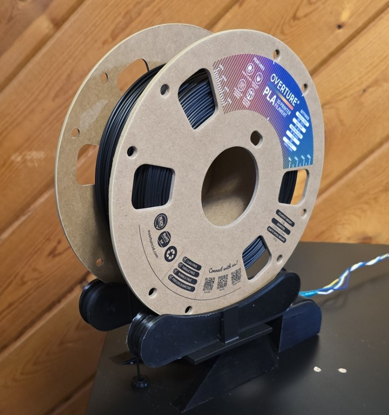
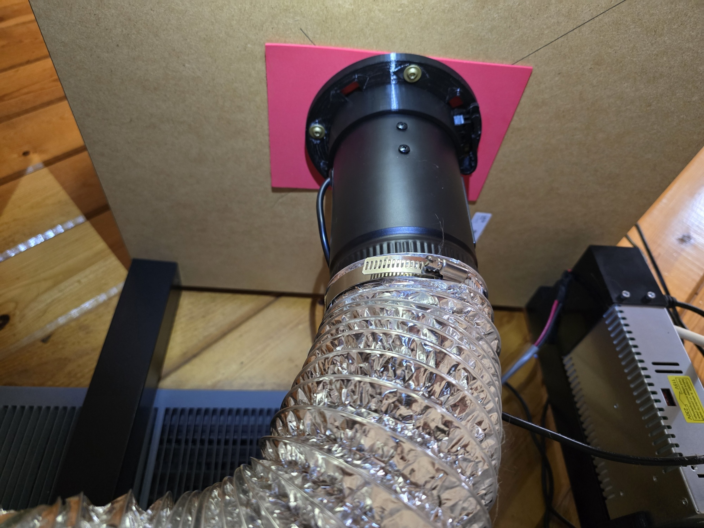
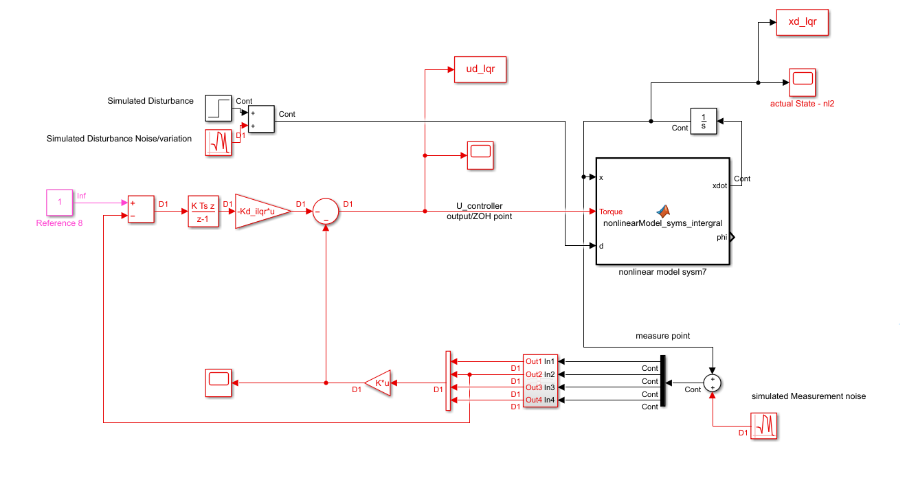

# Seth Emond

Welcome—take a look at my engineering projects below.

---

## Projects

### [Filament Spool Scale](https://github.com/sethemond/filament-spool-scale)

3D-printed filament spool holder with an integrated load cell for real-time filament weight monitoring. Designed to sit on top of an IKEA LACK Ender 3 enclosure and connected to OctoPrint for live weight monitoring and smooth payout of filament.

  

### [Low-Cost Air Filtration System for Desktop 3D Printer Emissions](https://github.com/sethemond/3D-Printer-VOC-Emissions-and-Exhaust-Holder)

Apartment-friendly solution for reducing VOC and ultrafine particle exposure from enclosed 3D printers without exterior venting—custom 3D-printed mounting hardware and wireless sensor network for under $100.

  

### [Stabilization of Motorcycles with Spherical Wheels](https://github.com/sethemond/Control-Systems-Paper__Stabilization-of-Motorcycles-with-Spherical-Wheels)

Control systems research developing dynamic models and stabilization strategies for a spherical-wheeled motorcycle platform—symbolic derivations with MATLAB/Simulink simulations demonstrating stabilization performance.

  

---
